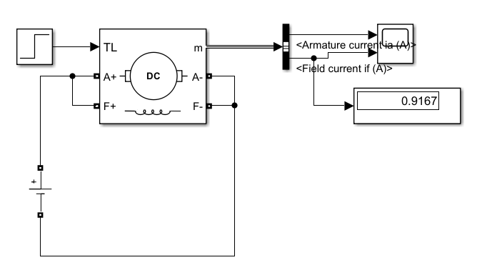
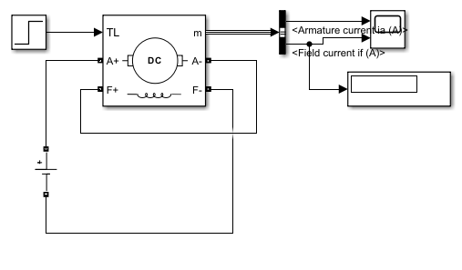
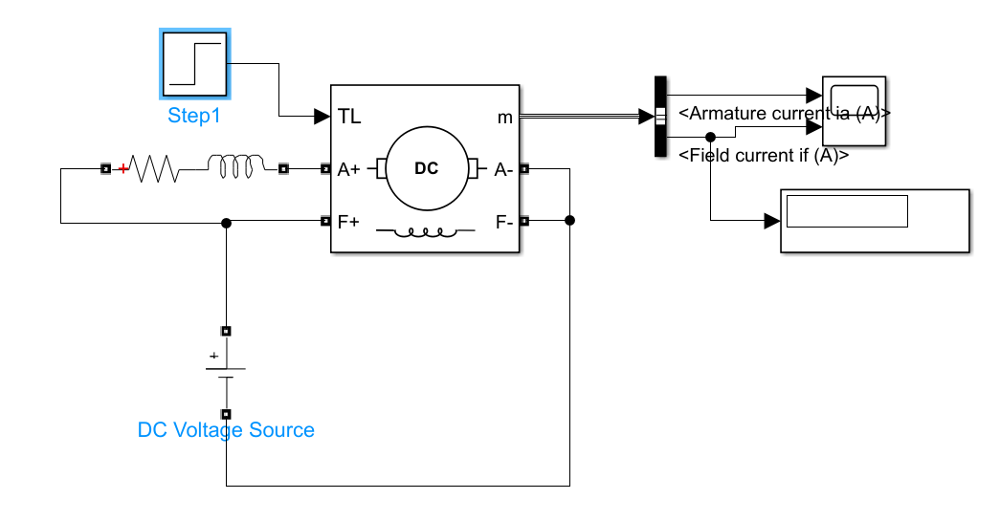

## DC Motor Configurations

### Shunt DC Motor

In a shunt DC motor, the field winding is connected in parallel with the armature. This keeps the magnetic flux nearly constant and provides relatively stable speed when the mechanical load changes.

For the step-load simulation, a sudden change in load torque is applied to observe the motor's speed and torque response.

#### Step Load Circuit

### Series DC Motor

In a series DC motor, the field winding is connected in series with the armature. As a result, the field flux depends on the armature current.

This configuration provides high starting torque, but its speed varies significantly with load. The series motor should not be operated without load because its speed can increase to unsafe levels.

#### Step Load Circuit

### Compound DC Motor

A compound DC motor combines both shunt and series field windings.

This configuration provides a balance between the high starting torque of a series motor and the better speed regulation of a shunt motor, making it suitable for applications that require both torque capability and relatively stable speed.

#### Step Load Circuit

