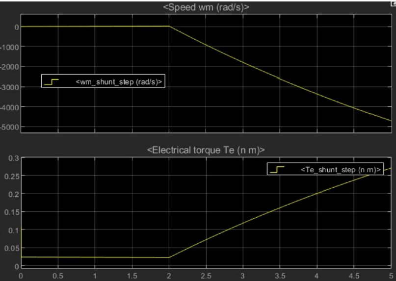
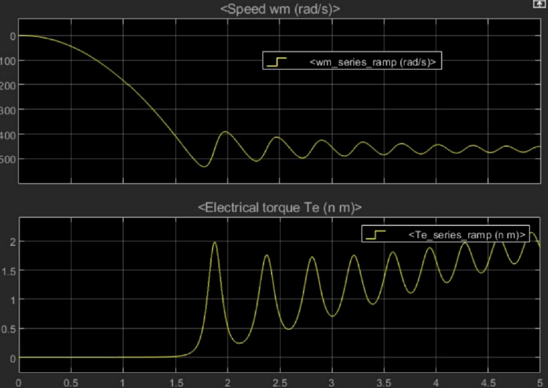
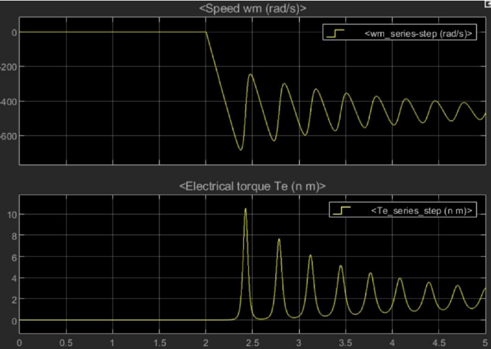
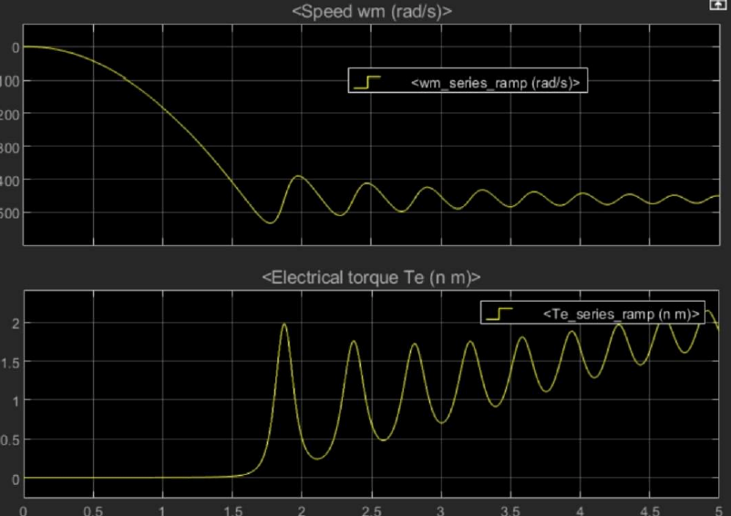
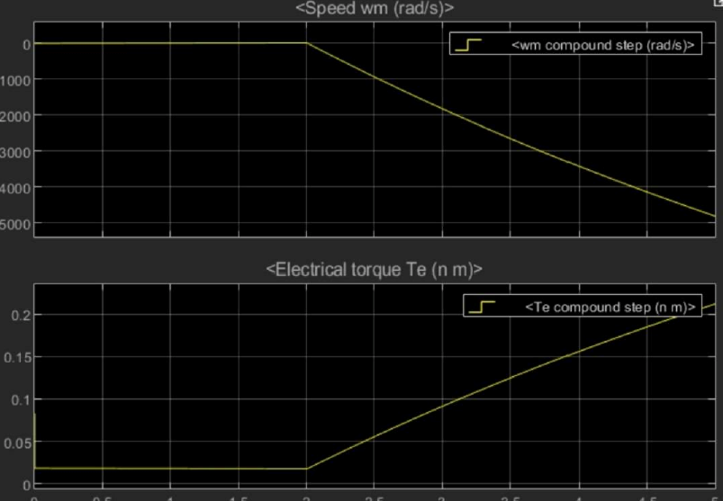
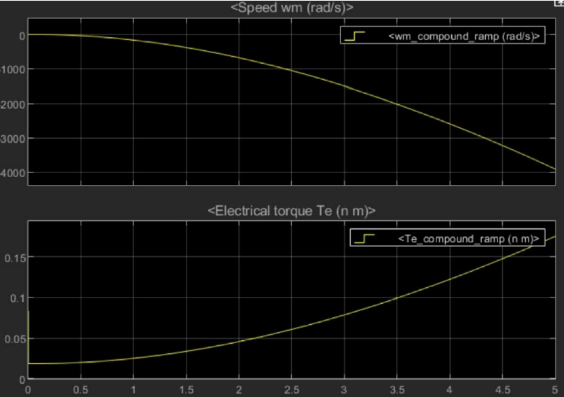

# DC Motor Torque-Speed Analysis

## Overview

This project compares the torque-speed behavior of shunt, series, and compound DC motors using MATLAB/Simulink.

Each motor is simulated under step and ramp load conditions to study changes in speed and electromagnetic torque under similar operating conditions.

## Theoretical Background

The main DC motor equations used in this analysis are:

- Armature voltage: V = Eb + IaRa
- Back EMF: Eb = Ke φω
- Electromagnetic torque: T = Kt φIa

These relationships describe how current, magnetic flux, torque, and speed affect the behavior of a DC motor.

## MATLAB/Simulink Simulation

The motor models were designed and simulated in MATLAB/Simulink.

For each motor configuration, two different load conditions were tested:

- Step Load
- Ramp Load

The simulation results are used to compare motor speed and electromagnetic torque as the mechanical load changes.

## Shunt DC Motor

In a shunt DC motor, the field winding is connected in parallel with the armature. This keeps the magnetic flux approximately constant and provides relatively good speed regulation.

### Step Load Circuit

### Step Load Output

### Ramp Load Output

## Series DC Motor

In a series DC motor, the field winding is connected in series with the armature, so the field flux depends on armature current.

The series motor provides high starting torque but has greater speed variation. It should not be operated without mechanical load because its speed may increase to an unsafe level.

### Step Load Circuit

### Step Load Output

### Ramp Load Output

## Compound DC Motor

A compound DC motor combines the characteristics of shunt and series motors.

It provides a balance between good starting torque and relatively stable speed.

### Step Load Circuit

### Step Load Output

### Ramp Load Output

## Comparison

- **Shunt Motor:** Better speed regulation and smaller speed variation under load
- **Series Motor:** High starting torque but greater speed variation
- **Compound Motor:** Balanced torque and speed characteristics

## Applications

- **Shunt Motor:** Fans, pumps, conveyors, and machine tools
- **Series Motor:** Cranes, elevators, locomotives, and starter motors
- **Compound Motor:** Heavy machinery, hoisting systems, and load handling systems

## Tools

- MATLAB
- Simulink
- DC Machine Modeling

## Repository Structure

- `Shunt_Motor` - Shunt motor Simulink models, circuit images, and results
- `Series_Motor` - Series motor Simulink models, circuit images, and results
- `Compound_Motor` - Compound motor Simulink models, circuit images, and results
- `Documentation` - Project report
- `Full_Load_Model.slx` - Additional Simulink model

## Conclusion

The simulations show clear differences between the three DC motor configurations.

The shunt motor provides better speed stability, the series motor provides high starting torque, and the compound motor offers a balance between torque capability and speed regulation.
